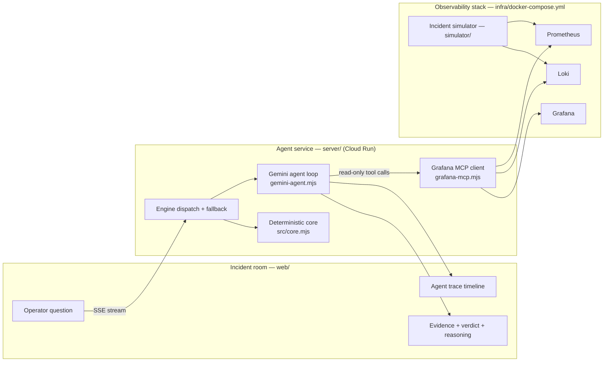

# CineOps Agent

**Find the failure. Save the premiere.**

CineOps Agent investigates media-pipeline incidents in a single pass: it asks the
observability stack what is wrong, correlates the evidence, and returns a root
cause with a recovery decision — while the premiere deadline is still on the
clock.

[](https://github.com/wenn-id/cineops-agent/actions/workflows/ci.yml)
[](LICENSE)
[](https://wenn-id.github.io/cineops-agent/)
[](server/gemini-agent.mjs)


Built for the **Grafana track** of [Agentic Cinema: The Blockbuster
Hackathon](https://agentic-cinema.devpost.com/) (Google Cloud × Devpost) — an
agentic take on production incident response for media & entertainment
workflows.

## Why it matters

A transcode farm saturating forty minutes before a live premiere is the M&E
nightmare: an on-call engineer hops between dashboards, greps logs, and
reconstructs the incident by hand. CineOps runs that investigation as a
tool-calling agent — the model selects the queries, the evidence lands as it
arrives, and the operator gets a verdict with cited evidence and a recovery
plan they can approve.

## Try it

| Demo | What you get |
| --- | --- |
| [Live incident room](https://wenn-id.github.io/cineops-agent/) | Instant investigation in replay mode — no setup, no keys |
| `npm start` | The agent service: server-side investigation streamed over SSE, with the live agent-trace timeline |
| `npm run stack:up` | The whole living incident: Prometheus + Loki + Grafana + telemetry simulator via docker compose |

## How it works



## How CineOps uses Gemini, Google Cloud, and Grafana

Every claim below is verifiable in the linked file — no integration is named
only in a README.

| Capability | Where | What to verify |
| --- | --- | --- |
| Gemini agent loop (multi-turn tool calling) | [`server/gemini-agent.mjs`](server/gemini-agent.mjs) | `TOOL_DECLARATIONS`, the `functionCall` → execute → `functionResponse` loop, `responseSchema` verdict, `thought` events |
| Gemini REST adapter | [`server/gemini.mjs`](server/gemini.mjs) | `generateContent` call with header auth, timeout, `GEMINI_MODEL` env |
| Grafana MCP client (read-only) | [`server/grafana-mcp.mjs`](server/grafana-mcp.mjs) | MCP streamable HTTP (initialize/session), and the hard allowlist: only `query_prometheus`, `query_loki_logs`, `search_dashboards` |
| Live telemetry execution | [`server/grafana-live.mjs`](server/grafana-live.mjs) | Per-stage PromQL/LogQL calls, `liveValue` provenance, per-target failure isolation |
| Evidence grounding (anti-hallucination) | [`server/gemini-agent.mjs`](server/gemini-agent.mjs) | `assembleResult` accepts only signal ids an executed tool returned; fixture values override model numbers |
| Grounded follow-up Q&A | [`server/followup.mjs`](server/followup.mjs) | Multi-turn answers from the investigation context only; citations filtered against context ids; unsupported questions answered honestly |
| Living incident telemetry | [`simulator/engine.mjs`](simulator/engine.mjs) | Incident arc (baseline → failure → recovery), Prometheus exposition, Loki log push |
| Agent evaluation harness | [`eval/run.mjs`](eval/run.mjs) | Outcome cases with latency budgets; CI gates on `npm run eval` |
| Google Cloud deployment | [`infra/README.md`](infra/README.md) | Cloud Run service (Dockerfile), Secret Manager setup, deploy commands |

Enable the live engines with `GEMINI_API_KEY` and `GRAFANA_URL` +
`GRAFANA_API_KEY`; verify a Gemini key in one command:

```bash
GEMINI_API_KEY=... npm run check:gemini
```

## Quickstart

```bash
npm ci
npm test     # 42 tests, no network needed
npm start    # build + agent service → http://127.0.0.1:8000
```

Open <http://127.0.0.1:8000> — the incident room detects the backend and runs
the investigation server-side. The full observability stack (Prometheus, Loki,
Grafana with the provisioned Neon Harbor dashboard, incident simulator):

```bash
npm run stack:up     # Grafana at http://localhost:3000 (admin / cineops)
```

Deploying to Cloud Run is three commands — see [`infra/README.md`](infra/README.md).

## Evaluation

```bash
npm run eval
```

Six scripted and deterministic cases evaluate agent outcomes — root-cause
accuracy, tool-grounded evidence, hallucination rejection, loop bounding,
outage fallback — each with a latency budget. CI runs the suite on every push,
so accuracy or latency regressions fail the build. With `GEMINI_API_KEY` set,
a live-model case runs against the fixture tools as well. Current status:
**6/6 pass** (see [`eval/README.md`](eval/README.md)).

## Engines, and honesty about what is live

The UI always names the engine that produced an investigation.

- **Public Pages demo** → replay mode: the deterministic investigator runs in
  the browser against the incident fixture, labeled `LOCAL REPLAY`.
- **Agent service without keys** → the deterministic engine runs server-side,
  labeled `SERVER AGENT · DETERMINISTIC CORE`.
- **With `GEMINI_API_KEY`** → live Gemini reasoning over the tool loop. Tool
  data still comes from the incident fixture unless MCP is configured.
- **With `GRAFANA_URL` + `GRAFANA_API_KEY`** → tool calls hit Grafana MCP for
  real; live values override the fixture with `liveValue` provenance, and
  evidence links to the matching dashboard.
- **Any engine failure** → an honest `fallback` status event resets the UI and
  the deterministic engine completes the investigation. Replayed tool data is
  always labeled `replay` — fixture data is never presented as a live call.

## Repository layout

```text
web/       incident room UI (static, zero-dependency)
src/       shared domain logic (investigator core, scenarios)
server/    Cloud Run agent service (orchestrator, Gemini loop, Grafana MCP)
simulator/ live incident telemetry (Prometheus metrics, Loki logs)
infra/     telemetry stack + Cloud Run deployment
eval/      agent evaluation harness (scaffold)
scripts/   build & validation
test/      unit + integration tests
```

## Project

- Live incident room (Pages, replay mode): <https://wenn-id.github.io/cineops-agent/>
- Repository: <https://github.com/wenn-id/cineops-agent>
- Google Cloud project: `cineops-agentic-cinema-2026`
- License: MIT
